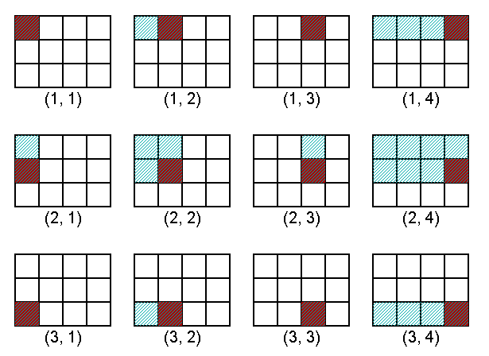
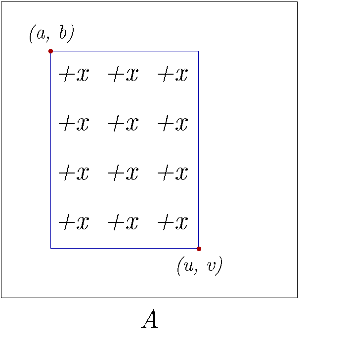
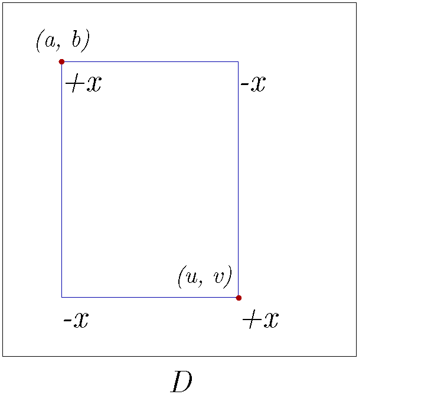

## Cây chỉ số nhị phân 2 chiều (BIT 2 chiều)

**Tác giả:** 
- Phạm Công Minh - THPT chuyên Khoa học Tự Nhiên, ĐHQGHN 

**Reviewer:**
- Lê Minh Hoàng - Đại học Khoa học Tự nhiên, ĐHQG-HCM
- Phạm Hoàng Hiệp - University of Georgia
- Ngô Nhật Quang - The University of Texas at Dallas 

---


## Giới thiệu

BIT 2 chiều là cấu trúc dữ liệu mở rộng của BIT 1 chiều. Công dụng chính của BIT 2 chiều là xử lý các truy vấn lên hình chữ nhật con trên một mảng 2 chiều. 

Bài viết yêu cầu người đọc hiểu rõ cách hoạt động của BIT 1 chiều. Các bạn có thể đọc về BIT 1 chiều tại đây: [VNOI - Cây chỉ số nhị phân](https://vnoi.info/wiki/algo/data-structures/fenwick.md#c%C3%A2y-ch%E1%BB%89-s%E1%BB%91-nh%E1%BB%8B-ph%C3%A2n).


## Bài toán

**Các định nghĩa**:

* Trong mảng hai chiều $A$, $A[u][v]$ là giá trị của phần tử hàng thứ $u$, cột thứ $v$.

* $A[u:x][v:y]$ là hình chữ nhật con có góc trái trên là $(u, v)$ và góc phải dưới là $(x, y)$. Nếu $u > x$ hoặc $v > y$ thì hình chữ nhật con rỗng.

* $\sum A[u:x][v:y]$ là tổng các phần tử trong hình chữ nhật con $A[u:x][v:y]$.

**Đề bài:**

Cho mảng 2 chiều $A$ có $N$ hàng $M$ cột (đánh số từ 1). Có $Q$ truy vấn thuộc 2 loại:

* $1$ $u$ $v$ $x$: Cộng $x$ vào $A[u][v]$.
* $2$ $u$ $v$: Tính $\sum A[1:u][1:v]$.

Giới hạn: $1 \leq N, M \leq 10^3$, $1 \leq Q \leq 2 \times 10^5$ 

### Thuật toán ngây thơ 1

Với truy vấn 1, ta cộng trực tiếp vào mảng. Với truy vấn 2, ta duyệt qua từng phần tử của $A[1:u][1:v]$ và cộng giá trị vào kết quả.

```cpp
int A[N][M];

void add(int u, int v, int x){
    A[u][v] += x;
}

int query(int u, int v){
    int sum = 0;
    for(int i = 1; i <= u; i++){
        for(int j = 1; j <= v; j++){
            sum += A[i][j];
        }
    }
    return sum;
}

```

#### Phân tích

* Độ phức tạp khi cập nhật: $O(1)$
* Độ phức tạp khi truy vấn: $O(u \times v) = O(N \times M)$
* Có $Q$ truy vấn, nên độ phức tạp là $O(Q + Q \times N \times M) = O(Q \times N \times M)$

### Thuật toán ngây thơ 2

Ta định nghĩa $lsb(x)$ là giá trị của bit $1$ nhỏ nhất trong biểu diễn nhị phân của $x$. Ví dụ:

* $lsb((11)_{10}) = lsb((1011)_2) = 1$
* $lsb((24)_{10}) = lsb((11000)_2) = 8$

Ta sẽ lưu $n$ BIT 1 chiều, mỗi BIT quản lý một hàng.

Như đã giới thiệu trong bài viết BIT 1 chiều, phần tử thứ $v$ trong BIT 1 chiều sẽ lưu tổng các phần tử trong đoạn $[i-lsb(i)+1, i]$. Ở đây, phần tử thứ $j$ của BIT thứ $i$ sẽ lưu $\sum A[i:i][j-lsb(j) + 1 : j]$.

Đối với truy vấn 1 ta update BIT của hàng $u$. Còn đối với truy vấn 2 ta duyệt qua và truy vấn trên từng BIT của các hàng từ $1$ đến $u$.

```cpp
int A[N][M], BIT[N][M];

void add(int u, int v, int x){
    for(v; v <= m; v += v&(-v))BIT[u][v]+=x;
}

int query(int u, int v){
    int sum = 0;
    for(int i = 1; i <= u; i++){
        for(int j = v; j > 0; j -= j&(-j))sum += BIT[i][j];
    }
    return sum;
}

void preprocess(){
    for(int i = 1; i <= n; i++){
        for(int j = 1; j <= m; j++){
            add(i, j, A[i][j]);
        }
    }
}

```

#### Phân tích

* Độ phức tạp tiền xử lý: $O(N \times M \times \log M)$
* Độ phức tạp khi cập nhật: $O(\log M)$
* Độ phức tạp khi truy vấn: $O(u \times \log M) = O(N \times \log M)$
* Có Q truy vấn, nên độ phức tạp là $O(Q \times \log M + Q \times N \times \log M) = O(Q \times N \times \log M)$

## BIT 2 chiều

Ta gọi BIT trong phần ngây thơ 2 là $BIT_{nt}$. Như vậy $BIT_{nt}[i][j] = \sum A[i:i][j-lsb(j) + 1 : j]$

Từ thuật toán *ngây thơ 2*, thay vì sử dụng $n$ BIT 1 chiều độc lập, ta có thể sử dụng một BIT 1 chiều lớn để quản lý toàn bộ $n$ BIT 1 chiều. Như vậy, mỗi phần tử của BIT lớn là một BIT nhỏ gồm $m$ phần tử, BIT nhỏ thứ $i$ quản lý thông tin về các $BIT_{nt}$ trong đoạn $[i-lsb(i)+1, i]$.

Trong BIT 2 chiều, phần tử thứ $j$ của BIT nhỏ thứ $i$ sẽ lưu:

$$\sum_{k = i-lsb(i)+1}^iBIT_{nt}[k][j]$$

Vì $BIT_{nt}[k][j] = A[k:k][j-lsb(j) + 1 : j]$ nên tổng này tương đương với:


$$
\sum_{k = i-lsb(i)+1}^iA[k:k][j-lsb(j) + 1 : j] \\
$$

Ta có thể viết lại biểu thức thành:

$$
\sum A[i - lsb(i) + 1:i][j-lsb(j) + 1 : j]
$$


Như vậy phần tử thứ $j$ của BIT thứ $i$ trong BIT 2 chiều lưu tổng các phần tử trong hình chữ nhật con có góc trái trên là $(i - lsb(i) + 1, j-lsb(j) + 1)$ và góc phải dưới là $(i, j)$.

Dưới đây là hình minh họa cho trường hợp $N = 3, M = 4$. 




### Cài đặt

Ta khai báo BIT 2 chiều dưới dạng một mảng $N \times M$ , trong đó `BIT[u][v]` lưu giá trị của phần tử thứ $v$ trong BIT thứ $u$;

```cpp
int BIT[N][M];
```

Hàm để update:

```cpp
void add(int u, int v, int x){
    for(int i = u; i <= n; i += i&(-i)){
        for(int j = v; j <= m; j += j&(-j))BIT[i][j]+=x;
    }
}
```

Hàm để truy vấn:

```cpp
int query(int u, int v){
    int sum = 0;
    for(int i = u; i > 0; i -= i&(-i)){
        for(int j = v; j > 0; j -= j&(-j))sum += BIT[i][j];
    }
    return sum;
}
```

Để tính tổng các phần tử trong một hình chữ nhật nhất định, ta có thể sử dụng tổng tiền tố 2 chiều, có công thức như sau:
$$
\begin{align}
\sum A[a:u][b:v] &= \sum A[1:u][1:v] - \sum A[1:a-1][1:v]\\
&- \sum A[1:u][1:b-1] + \sum A[1:a-1][1:b-1]
\end{align}
$$

### Phân tích


* Độ phức tạp khi cập nhật: $O(\log N \times \log M)$
* Độ phức tạp khi truy vấn: $O(\log N \times \log M)$
* Có Q truy vấn, nên độ phức tạp là $O(Q \times \log N \times \log M)$

### Cập nhật hình chữ nhật con, truy vấn phần tử

Ta thay đổi bài toán ban đầu như sau:

* $1$ $a$ $b$ $u$ $v$ $x$: Cộng $x$ vào các phần tử thuộc $A[a:u][b:v]$
* $2$ $u$ $v$: Tính $A[u][v]$

Tương tự với BIT 1 chiều, ta sẽ sử dụng mảng hiệu để cập nhật.

Ta có:
$$
\begin{aligned}
\sum A[1:i][1:j] &= \sum A[1:i-1][1:j] + \sum A[1:i][1:j-1] \\
&- \sum A[1:i-1][1:j-1] + \sum A[i][j]
\end{aligned}
$$

Do đó, ta có thể lưu $D[i][j] = A[i][j] - A[i-1][j] - A[i][j-1] + A[i-1][j-1]$. Khi đó, $A[i][j] = \sum D[1:i][1:j]$

Khi ta thực hiện truy vấn $1$, có $4$ giá trị của $D$ thay đổi:

* $D[a][b]$ tăng lên $x$
* $D[u+1][b]$ giảm đi $x$
* $D[a][v+1]$ giảm đi $x$
* $D[u+1][v+1]$ tăng lên $x$

Nếu vẫn chưa rõ, bạn đọc có thể tham khảo hình minh họa sau:





#### Cài đặt

Hàm cập nhật:

```cpp
void rectAdd(int a, int b, int u, int v, int x){
    add(a, b, x);
    add(u+1, v+1, x);
    add(u+1, b, -x);
    add(a, v+1, -x);
}
```


Hàm truy vấn tương tự như phần trước.

### Cập nhật hình chữ nhật con, truy vấn hình chữ nhật con

Ta thay đổi bài toán ban đầu:

* $1$ $a$ $b$ $u$ $v$ $x$: Cộng $x$ vào các phần tử thuộc $A[a:u][b:v]$

* $2$ $u$ $v$: Tính $\sum A[1:u][1:v]$

Ta tiếp tục sử dụng ý tưởng mảng hiệu. Do $A[i][j] = \sum D[1:i][1:j]$ nên ta có:

$$
\begin{aligned}
\sum A[1:i][1:j] &= \sum_{k=1}^{i}\sum_{l=1}^{j}A[k][l]\\
&=\sum_{k=1}^{i}\sum_{l=1}^{j}\sum D[1:k][1:l]\\
&=\sum_{k=1}^{i}\sum_{l=1}^{j}\sum_{a=1}^l\sum_{b=1}^k D[a][b]\\
&=\sum_{k=1}^{i}\sum_{l=1}^{j}(i-k+1)(j-l+1)D[k][l]\\
&=\sum_{k=1}^i\sum_{l=1}^j((i+1)\times (j+1)\times D[k][l] - (j+1)\times k\times D[k][l]\\
&-(i+1)\times l\times D[k][l] + k\times l\times D[k][l])\\
&= \sum_{k=1}^i\sum_{l=1}^j (i+1)\times(j+1)\times D[k][l] - \sum_{k=1}^i\sum_{l=1}^j (j+1)\times k \times D[k][l] \\
&- \sum_{k=1}^i\sum_{l=1}^j (i+1)\times l \times D[k][l] + \sum_{k=1}^i\sum_{l=1}^j k \times l \times D[k][l]
\end{aligned}
$$

Dựa vào công thức biến đổi ở trên, ta cần duy trì $D[i][j], i\times D[i][j], j\times D[i][j], i\times j\times D[i][j]$ bằng bốn BIT:
```cpp
int BIT[4][N][M]; // {D[i][j]; i*D[i][j]; j*D[i][j]; i*j*D[i][j]}

void add(int u, int v, int x){
    for(int i = u; i <= n; i += i&(-i)){
        for(int j = v; j <= m; j += j&(-j)){
            BIT[0][i][j] += x;
            BIT[1][i][j] += u * x;
            BIT[2][i][j] += v * x;
            BIT[3][i][j] += u * v * x;
        }
    }
}

void rectAdd(int a, int b, int u, int v, int x){
    add(a, b, x);
    add(a, v + 1, -x);
    add(u + 1, b, -x);
    add(u + 1, v + 1, x);
}
```
Khi truy vấn, ta lấy tửng hệ số nhân lên rồi cộng trừ để ra kết quả

```cpp
int query(int u, int v){
    int a[4] = {0, 0, 0, 0};
    for(int ty = 0; ty < 4; ty++){
        for(int i = u; i > 0; i -= i&(-i)){
            for(int j = v; j > 0; j -= j&(-j)){
                a[ty] += BIT[ty][i][j];
            }
        }
    }
    return a[0]*(u + 1)*(v + 1) - a[1]*(v + 1) - a[2]*(u + 1) + a[3];
}
```

## Kĩ thuật nén BIT 2 chiều

*Phần này được lấy nhiều cảm hứng từ [blog cá nóc cắn cáp](https://leduythuccs.github.io/2019-05-30-k-thu-t-n-n-c-y-bit2d/)*

**Chú ý kĩ thuật này chỉ dùng được khi ta biết trước tất cả các truy vấn.**

Ta thay đổi giới hạn bài toán ban đầu thành $1 \leq N, M, Q \leq 10^5$. 

Ta sẽ không thể lưu được toàn bộ BIT 2 chiều bằng một mảng $N \times M$, nếu sử dụng `std::map` hay `std::unordered_map` thì code sẽ không đủ nhanh để AC.

Tuy nhiên, ta nhận thấy rằng, với mỗi truy vấn, chỉ có $\log N$ BIT được duyệt qua, và mỗi BIT chỉ có thao tác là cộng một phần tử và tính tổng một tiền tố. Vì vậy, đối với mỗi BIT, ta có thể lưu lại tất cả các vị trí được cộng và được truy vấn trước, sau đó tiến hành rời rạc hóa các vị trí đó. Do có $Q$ truy vấn, mỗi truy vấn tạo thêm tối đa $1$  vị trí trên $\log N$ BIT nên có tổng cộng $Q \times \log N$ vị trí cần lưu.
Để lưu như vậy, ta tạo 2 hàm mới chỉ để lưu các vị trí được truy vấn.

```cpp
vector<int> pos[N];
vector<int> BIT[N];

void fakeAdd(int u, int v, int x){
    for(u; u <= n; u += u&(-u)){
        pos[u].push_back(v);
    }
}

void fakeQuery(int u, int v){
    for(u; u <= n; u += u&(-u)){
        pos[u].push_back(v);
    }
}
```

Sau khi lưu các vị trí cần thiết, ta tiến hành rời rạc hóa trên từng BIT.

```cpp
void compress(){
    for(int i = 1; i <= n; i++){
        pos[i].push_back(0);
        sort(pos[i].begin(), pos[i].end());
        pos[i].erase(unique(pos[i].begin(), pos[i].end()), pos[i].end());
        BIT[i].assign(pos[i].size(), 0);
    }
}
```

Khi đã rời rạc hóa xong, ta thực hiện các truy vấn như thường. Lưu ý lúc này mảng `pos` chỉ để ánh xạ lại index trên mảng đã được rời rạc hóa. 

```cpp
void add(int u, int v, int x){
    for(int i = u; i <= n; i += i&(-i)){
        for(int j = lower_bound(pos[i].begin(), pos[i].end(), v) - pos[i].begin(); j < BIT[i].size(); j += j&(-j)){
            BIT[i][j] += x;
        }
    }
}

void query(int u, int v){
    int sum = 0;
    for(int i = u; i > 0; i -= i&(-i)){
        for(int j = lower_bound(pos[i].begin(), pos[i].end(), v) - pos[i].begin(); j > 0; j -= j&(-j)){
            sum += BIT[i][j];
        }
    }
    return sum;
}

```

## Bài tập áp dụng

* [SPOJ - MATSUM](https://www.spoj.com/problems/MATSUM/)
* [Codeforces - The Untended Antiquity](https://codeforces.com/problemset/problem/869/E)
* [DHBB 2022 - Thao tác trên bảng](https://lqdoj.edu.vn/problem/dhbb2022table)
* [Thi thử VNOI - Đếm nghịch thế](https://codeforces.com/group/FLVn1Sc504/contest/212925/problem/G)
* [LQDOJ - Khu Rừng 5](https://lqdoj.edu.vn/problem/forest5)
* [LQDOJ - Khu Rừng 6](https://lqdoj.edu.vn/problem/forest6)
* [VNOJ - Another Longest Increasing Subsequence Problem](https://oj.vnoi.info/problem/lis2vn)


