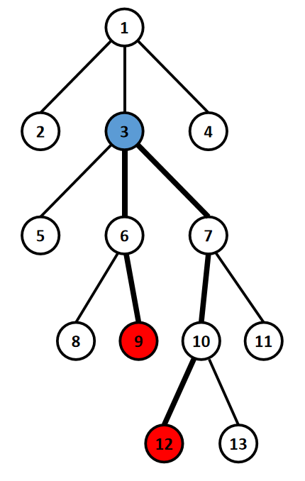
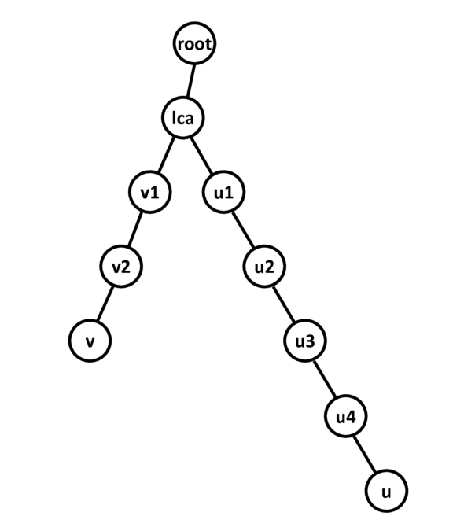
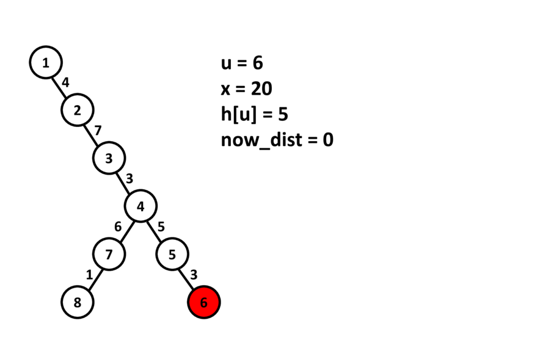
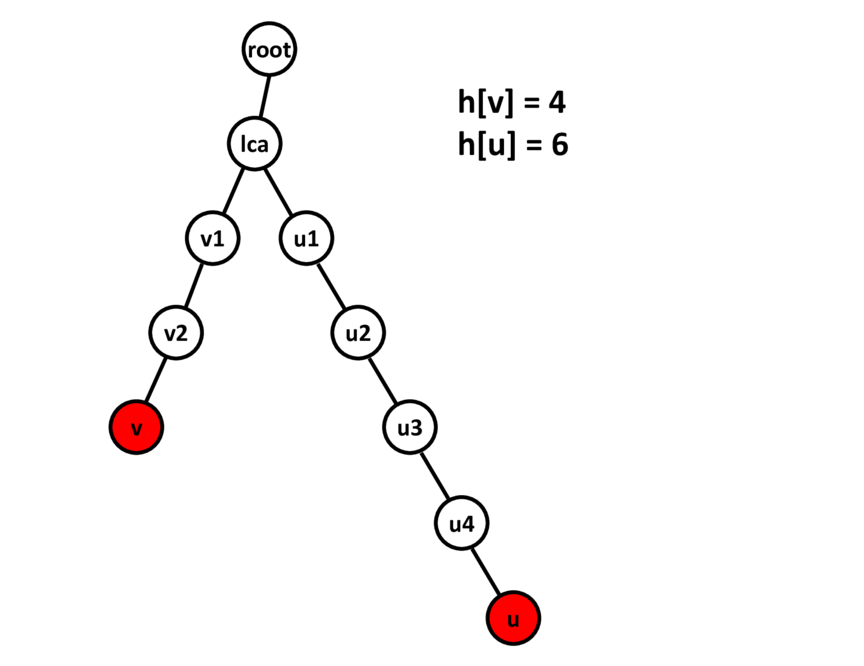
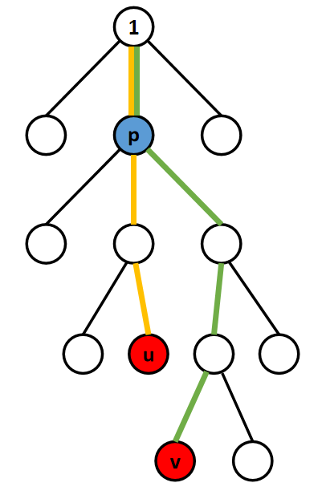

**Tác giả:** 
- Lê Minh Hoàng - Phổ thông Năng khiếu, ĐHQG-HCM

**Reviewer:**
- Trần Quang Lộc - ITMO University
- Hồ Ngọc Vĩnh Phát - Đại học Khoa học Tự nhiên, ĐHQG-HCM
- Nguyễn Phú Bình - THPT Chuyên Hùng Vương, Bình Dương
- Trần Xuân Bách - THPT Chuyên Khoa học Tự nhiên, ĐHQGHN

---


## Giới thiệu

Bài toán tìm tổ tiên chung gần nhất (Lowest Common Ancestor - LCA) là một dạng bài quen thuộc thường gặp trong các cuộc thi lập trình thi đấu.

Bài toán tìm LCA có nhiều cách giải:
- **Binary Lifting (Sparse Table)**: $\mathcal{O}(N\log{N})$ tiền xử lý, $\mathcal{O}(\log{N})$ mỗi truy vấn.
- **Euler Tour + RMQ (Segment tree)**: $\mathcal{O}(N)$ tiền xử lý, $\mathcal{O}(\log{N})$ mỗi truy vấn.
- **Euler Tour + RMQ (Sparse Table)**: $\mathcal{O}(N\log{N})$ tiền xử lý, $\mathcal{O}(1)$ mỗi truy vấn.
- $\dots$

Trong bài viết này, ta tập trung vào cách đầu tiên là sử dụng kỹ thuật Binary Lifting để tìm LCA.

**Lưu ý:** Trong suốt bài viết mình dùng `__lg(x)` để tính $\log_2$ của 1 số vì ta cần giá trị nguyên, còn `log2(x)` thì trả về số thực. Nếu không muốn dùng hàm thì có thể tính trước như sau:
```cpp
int lg2[N];
void preprocess() {
    lg2[1] = 0;
    for (int i = 2; i < N; ++i)
        lg2[i] = lg2[i / 2] + 1;
}
```

## Bài toán

Cho một cây gồm $N$ đỉnh có gốc tại đỉnh $1$. Có $Q$ truy vấn, mỗi truy vấn gồm $1$ cặp số $(u, v)$ và ta cần tìm LCA của $u$ và $v$, tức là tìm một đỉnh $w$ xa gốc nhất nằm trên đường đi từ $u$ và $v$ đến gốc. Đặc biệt, nếu $u$ là tổ tiên của $v$, thì $u$ là LCA của $u$ và $v$.

Giới hạn: $N, Q \leq 2 \cdot 10^5$

<!--430x678-->


## Ngây thơ

- Đặt $h(u)$ là độ cao của đỉnh $u$ (độ cao của $1$ đỉnh được định nghĩa bằng khoảng cách từ đỉnh đó đến gốc của cây). Ví dụ: $h(1) = 0, h(3) = 1, h(9) = 3,\ldots$
- Để trả lời truy vấn $(u, v)$, không mất tính tổng quát, giả sử $h(u) > h(v)$:
    - **Bước 1:** lặp lại thao tác cho $u$ nhảy lên cha của $u$ đến khi $h(u) = h(v)$.
    - **Bước 2:** lặp lại thao tác cho $u$ và $v$ nhảy lên cha của chúng đến khi $u$ và $v$ trùng nhau (đỉnh đó là LCA của $u$ và $v$ ban đầu).

<!--590x670-->


Ví dụ:
- Ta cần tìm LCA của $u$ và $v$. Ban đầu $h(u) > h(v)$.
- Ta lặp lại thao tác cho $u$ nhảy lên cha của $u$ đến khi $h(u) = h(v)$:
    - $u = par[u] = u4$
    - $u = par[u] = u3$
    - dừng thao tác vì $h(u) = h(v)$
- Sau đó, ta cho $u$ và $v$ nhảy lên cha của chúng và lặp lại thao tác đến khi $2$ đỉnh này trùng nhau:
    - $u = par[u] = u2, v = par[v] = v2$
    - $u = par[u] = u1, v = par[v] = v1$
    - $u = par[u] = lca, v = par[v] = lca$
    - dừng thao tác vì $u$ và $v$ trùng nhau ($u = v = lca$)

```cpp
vector<int> g[N]; // g[u]: tập các đỉnh kề với u
int par[N];     // par[u] = p nếu cha của u là p
int h[N];
void dfs(int u) {
    for (int v : g[u]) {
        if (v == par[u]) continue;
        h[v] = h[u] + 1;
        par[v] = u;
        dfs(v);
    }
}

int lca(int u, int v) {
    // Không mất tính tổng quát, xét h[u] >= h[v]
    if (h[u] < h[v]) swap(u, v);

    // cho u nhảy lên cha đến khi h[u] = h[v]
    while (h[u] > h[v])
        u = par[u];

    // cho u và v nhảy lên cha đến khi u trùng v
    while (u != v) {
        u = par[u];
        v = par[v];
    }

    return u;
}
```

### Phân tích:
- Độ phức tạp tiền xử lý: $\mathcal{O}(N)$ (tạo mảng $h$)
- Độ phức tạp khi truy vấn: $\mathcal{O}(N)$ (độ cao tối đa của 1 đỉnh là $N-1$ nên số bước nhảy tối đa là $N-1$)
- Có $Q$ truy vấn, vì thế tổng độ phức tạp là $\mathcal{O}(N + Q \cdot N) = O(Q \cdot N)$

Đối chiếu giới hạn, cách "ngây thơ" trên tỏ ra chậm chạp, không đủ để xử lí yêu cầu bài toán.

## Binary Lifting (nâng nhị phân)
Đầu tiên, ta sẽ tìm hiểu về ý tưởng của Binary Lifting qua bài toán con của $LCA$.

## Bài toán 1
Cho một cây gồm $N$ đỉnh có gốc tại đỉnh $1$. Có $Q$ truy vấn, mỗi truy vấn gồm $1$ cặp số $(u, k)$, ta cần in ra tổ tiên thứ $k$ của $u$ (tổ tiên thứ $k$ của $u$ là $par[par[\ldots[u \underset{\color{blue}{k \text{ lần}}}{\color{blue}{\underbrace{\color{blue}{]\ldots]]}}}}$ ).

Giới hạn: $N, Q \leq 10^5$

### Thuật toán ngây thơ
Ta lặp lại câu lệnh `u = par[u]` trong k lần.
```cpp
int par[N];
int ancestor_k(int u, int k) {
    while (k >= 1) {
        u = par[u];
        --k;
    }
    return u;
}
```

#### Phân tích:
- Độ phức tạp tiền xử lý: $\mathcal{O}(N)$ (tạo mảng $par$)
- Độ phức tạp truy vấn: $\mathcal{O}(K) = \mathcal{O}(N)$
- Có $Q$ truy vấn, vì thế tổng độ phức tạp là $\mathcal{O}(N + Q \cdot N)$

Câu hỏi đặt ra là ta còn có thể tối ưu thời gian truy vấn được hay không?
- Nhận xét: Thay vì nhảy từng bước nhỏ độ dài $1$, ta có thể nhảy các bước lớn độ dài $2$. Từ đó, ta có thể giảm thời gian truy vấn xuống còn $\mathcal{O}(\frac{K}2)$

### Thuật toán tối ưu 1.1
- Ta xây dựng mảng $up2[N]$ là tổ tiên thứ $2$ của mỗi đỉnh.
- Khi truy vấn, ta nhảy các bước độ dài $2$ trước, sau đó kiểm tra xem $k$ có $\geq 1$ hay không (vì $k$ mod $2$ dư $0$ hoặc $1$).

```cpp
int par[N], up2[N];
void preprocess() {
    for (int u = 1; u <= n; ++u)
        up2[u] = par[par[u]];
}

int ancestor_k(int u, int k) {
    while (k >= 2) {
        u = up2[u];
        k -= 2;
    }
    if (k >= 1) {
        u = par[u];
        --k;
    }
    return u;
}
```

#### Phân tích:
- Độ phức tạp tiền xử lý: $\mathcal{O}(2N)$ (tạo mảng $par$ và $up2$)
- Độ phức tạp truy vấn: $\mathcal{O}(\frac{K}2 + 1) = \mathcal{O}(\frac{N}2 + 1)$ (1 vòng while và 1 lệnh if)
- Có $Q$ truy vấn, vì thế tổng độ phức tạp thời gian là $\mathcal{O}(2N + Q \cdot (\frac{N}2 + 1))$
- Độ phức tạp bộ nhớ: $\mathcal{O}(2N)$ (2 mảng $par$ và $up2$)

### Thuật toán tối ưu 1.2
Ta còn có thể tối ưu thời gian truy vấn được hay không?
- Nhận xét: Thay vì nhảy từng bước nhỏ độ dài $2$, ta có thể nhảy các bước lớn độ dài $4$. Từ đó, ta có thể giảm thời gian truy vấn xuống còn $\mathcal{O}(\frac{K}4)$.

```cpp
int par[N], up2[N], up4[N];
void preprocess() {
    for (int u = 1; u <= n; ++u) up2[u] = par[par[u]];
    for (int u = 1; u <= n; ++u) up4[u] = up2[up2[u]];
}

int ancestor_k(int u, int k) {
    while (k >= 4) u = up4[u], k -= 4;
    if (k >= 2) u = up2[u], k -= 2;
    if (k >= 1) u = par[u], --k;
    return u;
}
```

#### Phân tích:
- Độ phức tạp tiền xử lý: $\mathcal{O}(3N)$ (tạo mảng $par$, $up2$ và $up4$)
- Độ phức tạp truy vấn: $\mathcal{O}(\frac{K}4 + 2) = \mathcal{O}(\frac{N}4 + 2)$ (1 vòng while và 2 lệnh if)
- Có $Q$ truy vấn, vì thế tổng độ phức tạp thời gian là $\mathcal{O}(3N + Q \cdot (\frac{N}4 + 2))$
- Độ phức tạp bộ nhớ: $\mathcal{O}(3N)$ (3 mảng $par$, $up2$ và $up4$)

### Thuật toán tối ưu 1.3
Ta vẫn có thể tối ưu thời gian truy vấn bằng cách nhảy các bước lớn hơn (độ dài $8$).

```cpp
int par[N], up2[N], up4[N], up8[N];
void preprocess() {
    for (int u = 1; u <= n; ++u) up2[u] = par[par[u]];
    for (int u = 1; u <= n; ++u) up4[u] = up2[up2[u]];
    for (int u = 1; u <= n; ++u) up8[u] = up4[up4[u]];
}

int ancestor_k(int u, int k) {
    while (k >= 8) u = up8[u], k -= 8;
    if (k >= 4) u = up4[u], k -= 4;
    if (k >= 2) u = up2[u], k -= 2;
    if (k >= 1) u = par[u], --k;
    return u;
}
```

#### Phân tích:
- Độ phức tạp tiền xử lý: $\mathcal{O}(4N)$ (tạo mảng $par$, $up2$, $up4$ và $up8$)
- Độ phức tạp truy vấn: $\mathcal{O}(\frac{K}8 + 3) = \mathcal{O}(\frac{N}8 + 3)$ (1 vòng while và 3 lệnh if)
- Có $Q$ truy vấn, vì thế tổng độ phức tạp thời gian là $\mathcal{O}(4N + Q \cdot (\frac{N}8 + 3))$
- Độ phức tạp tiền xử lý: $\mathcal{O}(4N)$ (4 mảng $par$, $up2$, $up4$ và $up8$)

### Thuật toán tối ưu 2
Nếu ta làm tiếp như thuật toán tối ưu $1.3$ (tiếp tục tạo các mảng $up16, up32, \dots, up65536$) ta sẽ có $\log_2(N)$ mảng up, độ phức tạp bài toán lúc này như sau:
- Độ phức tạp tiền xử lý: $\mathcal{O}(N \cdot (1 + \log_2(N)) = \mathcal{O}(N \cdot \log_2(N))$ (mảng $par$ và $\log_2$ mảng $up$)
- Độ phức tạp truy vấn: $\mathcal{O}(\frac{K}{2^{\log_2(N)}} + \log_2(N)) = \mathcal{O}(\log_2(N))$ (1 vòng while và $log_2$ lệnh if)
- Có $Q$ truy vấn, vì thế tổng độ phức tạp thời gian là $\mathcal{O}(N \cdot \log_2(N) + Q \cdot \log_2(N))$
- Độ phức tạp bộ nhớ: $\mathcal{O}(N \cdot \log_2(N))$ (mảng $par$ và $\log_2$ mảng $up$)

Nhưng nếu dùng $\log_2$ mảng $up$ sẽ mang đến cho ta nhiều bất tiện (code dài, dễ sai,...). Do đó, ta có thể đặt:
- $up[u][j]$ là tổ tiên thứ $2^j$ của $u$ (tương ứng $up2^j[u]$).
    - Cha của $u$ là tổ tiên thứ $1$ (đầu tiên) của $u$.
        - $up[u][0] = par[u]$
    - Đặt $x$ là tổ tiên thứ $2^{j-1}$ của $u$, ta có, tổ tiên thứ $2^{j-1}$ của $x$ là tổ tiên thứ $2^j$ của $u$ (vì $2^{j-1} + 2^{j-1} = 2^j$)

$$\begin{cases}
x &= up[u][j - 1] \\
up[u][j] &= up[x][j - 1]
\end{cases}$$

- Ta có công thức truy hồi sau:

$$\begin{cases}
up[u][j] = par[u] & \text{ với } j = 0 \\ 
up[u][j] = up[up[u][j-1]][j-1] & \text{ với } j > 0 \text{ và } 2^j \leq h[u] \\
up[u][j] = 0 \text{ (NULL)} & \text{ với } j > 0 \text{ và } 2^j > h[u]
\end{cases}$$

```cpp
int par[N], up[N][17];
void preprocess() {
    for (int u = 1; u <= n; ++u) up[u][0] = par[u];
    for (int j = 1; j < 17; ++j)
        for (int u = 1; u <= n; ++u)
            up[u][j] = up[up[u][j - 1]][j - 1];
}

int ancestor_k(int u, int k) {
    for (int j = 16; j >= 0; --j)
        if (k >= (1 << j)) u = up[u][j], k -= 1 << j;
    return u;
}
```

### Thuật toán tối ưu 3
Nhận xét: Ta luôn có thể tách một số nguyên dương thành tổng các lũy thừa phân biệt của 2 (hệ nhị phân). Ví dụ: $25 = 2^4 + 2^3 + 2^0 = 11001_2$.

Từ nhận xét trên, ta có một cách khác để nhảy lên tổ tiên thứ $k$ của $u$ là duyệt $j$ từ $0$ đến $\log_2(k)$, nếu bit thứ $j$ của $k$ là $1$ thì ta cho $u$ nhảy lên tổ tiên thứ $2^j$ của nó.

```cpp
int par[N], up[N][17];
void preprocess() {
    for (int u = 1; u <= n; ++u) up[u][0] = par[u];
    for (int j = 1; j < 17; ++j)
        for (int u = 1; u <= n; ++u)
            up[u][j] = up[up[u][j - 1]][j - 1];
}

int ancestor_k(int u, int k) {
    for (int j = 0; (1 << j) <= k; ++j)
        if (k >> j & 1) u = up[u][j];
    return u;
}
```

Qua đó, ta có thể thấy rằng Binary Lifting chỉ đơn giản là một cách tiền xử lý dữ liệu nhằm giúp cho thời gian truy vấn tối ưu hơn. Về tính chất, Binary Lifting khá giống với chặt nhị phân, khác ở chỗ mỗi lần, Binary Lifting thì ta thử nhảy $2^k$ đơn vị, còn chặt nhị phân thì ta thử nhảy $\frac{hi - lo + 1}{2}$ đơn vị.

## Bài toán 2
Cho một cây có trọng số gồm $N$ đỉnh có gốc tại đỉnh $1$. Có $Q$ truy vấn, mỗi truy vấn gồm $1$ cặp số $(u, x)$, ta cần in ra $v$ là tổ tiên xa nhất của $u$ thỏa tổng trọng số trên đường đi từ $u$ đến $v$ $\leq x$. Giới hạn: $N, Q \leq 10^5$

### Thuật toán 1
Ta xây dựng mảng $dist[u][j]$ là khoảng cách từ $u$ đến tổ tiên thứ $2^j$ của $u$.

Cách làm dễ nhận ra là chặt nhị phân giá trị của $k$, sau đó so sánh $x$ với khoảng cách từ $u$ đến tổ tiên thứ $k$ của $u$.

```cpp
int dist[N][17];
int calc_dist(int u, int k) {
    int sum = 0;
    for (int j = 0; (1 << j) <= k; ++j)
        if (k >> j & 1) {
            sum += dist[u][j];
            u = up[u][j];
        }
    return sum;
}

int solve(int u, int x) {
    int lo = 0, hi = h[u], mid, ans = 0;
    while (lo <= hi) {
        mid = (lo + hi) / 2;
        if (calc_dist(u, mid) <= x) {
            ans = mid;    
            lo = mid + 1;
        }
        else hi = mid - 1;
    }
    return ancestor_k(u, ans);
}
```

#### Phân tích
- Độ phức tạp tiền xử lý: $\mathcal{O}(N\log N)$ (tạo mảng $up$ và $dist$)
- Độ phức tạp truy vấn: $\mathcal{O}(\log N)$ (chặt nhị phân) $\times$ $\mathcal{O}(\log N)$ (tính khoảng cách) = $\mathcal{O}(\log^2N)$
- Có $Q$ truy vấn, vì thế tổng độ phức tạp là $\mathcal{O}(N\log N + Q\log^2N)$

### Thuật toán 2
Ta có nhận xét:
- Ta đã tính trước các khoảng cách có độ lớn $2^j$ (mảng $dist$)
- Từ đó, ta có thể nhảy theo từng bước $2^j$ để tính khoảng cách trong $\mathcal{O}(1)$

<!--915x570-->


```cpp
int dist[N][17];
int solve(int u, int x) {
    int now_dist = 0, k = 0;
    for (int j = __lg(h[u]); j >= 0; --j) {
        // nếu khoảng cách từ u ban đầu đến tổ tiên thứ (k + 2^j) <= x
        if (h[u] >= (1 << j) && now_dist + dist[u][j] <= x) {
            now_dist += dist[u][j];
            k |= 1 << j;
            u = up[u][j];
        }
    }
    return u;
}
```

#### Phân tích
- Độ phức tạp tiền xử lý: $\mathcal{O}(N\log N)$ (tạo mảng $up$ và $dist$)
- Độ phức tạp truy vấn: $\mathcal{O}(\log N)$ (chặt nhị phân) $\times$ $\mathcal{O}(1)$ (tính khoảng cách) = $\mathcal{O}(\log N)$
- Có $Q$ truy vấn, vì thế tổng độ phức tạp là $\mathcal{O}(N\log N + Q\log N)$

## Ứng dụng Binary Lifting vào bài toán LCA
Dễ thấy: nếu $x$ là tổ tiên chung của $u$ và $v$ ($x \neq$ gốc) thì $par[x]$ cũng là tổ tiên chung của $u$ và $v$. Do đó, ta có thể tìm tổ tiên chung gần nhất của $u$ và $v$ bằng Binary Lifting.

Bằng cách sử dụng mảng $up$, ta có thể nhảy từ $u$ đến bất kì tổ tiên nào chỉ trong $\mathcal{O}(\log N)$ (bài toán tìm tổ tiên thứ $k$). Ta có thể tính mảng này bằng hàm $DFS$ như sau:

```cpp
void dfs(int u) {
    for (int v : g[u]) {
        if (v == up[u][0]) continue;
        h[v] = h[u] + 1;
        
        up[v][0] = u;
        for (int j = 1; j < 20; ++j)
            up[v][j] = up[up[v][j - 1]][j - 1];

        dfs(v);
    }
}
```

Bước khởi tạo này chi phí $\mathcal{O}(N\log N)$ bộ nhớ lẫn thời gian.

Cách tìm LCA giống hệt thuật toán ngây thơ 1, nhưng để tăng tốc, thay vì nhảy lên cha ở mỗi bước, ta dùng mảng $up$ để nhảy, từ đó thu được độ phức tạp $\mathcal{O}(\log N)$ cho mỗi truy vấn. Cụ thể:

- Gọi $h(u)$ là độ cao của đỉnh $u$. Để tính $LCA(u, v)$, giả sử $h(u) > h(v)$, đầu tiên ta tìm $u'$ là tổ tiên của $u$ và có $h(u') = h(v)$:
    - Rõ ràng, ta cần nhảy từ $u$ lên cha thứ $k = h(u) - h(v)$.

- Sau khi $u$ và $v$ đã ở cùng độ cao, ta sẽ tính $LCA(u, v)$:
    - Nếu $u = v$ thì $LCA(u, v)$ chính là $u$ và $v$.
    - Nếu $u \neq v$ thì ta dùng Binary Lifting để tìm $k$ lớn nhất sao cho tổ tiên thứ $k$ của $u$ và $v$ khác nhau (không phải tổ tiên chung). Lúc này, tổ tiên thứ $k+1$ chính là tổ tiên chung của $u$ và $v$.
        - Ta duyệt $j$ từ $\log_2(h(u))$ về $0$
        - Nếu tổ tiên thứ $2^j$ của $u$ và $v$ khác nhau thì ta cho cả $u$ và $v$ nhảy lên tổ tiên thứ $2^j$ của chúng. Cuối cùng thì $u$ và $v$ sẽ có cùng cha (tổ tiên thứ $k+1$ là cha của tổ tiên thứ $k$), vậy nên khi đó $LCA(u, v) = par[u] = par[v] = up[u][0] = up[v][0]$. 

<!--864x666-->


```cpp
int h[N], up[N][20];
int lca(int u, int v) {
    if (h[u] != h[v]) {
        if (h[u] < h[v]) swap(u, v);
    
        // Tìm tổ tiên u' của u sao cho h(u') = h(v)
        int k = h[u] - h[v];
        for (int j = 0; (1 << j) <= k; ++j)
            if (k >> j & 1) // Nếu bit thứ j của k là 1
                u = up[u][j];
    }
    if (u == v) return u;
    
    // Tìm lca(u, v)
    int k = __lg(h[u]);
    for (int j = k; j >= 0; --j)
        if (up[u][j] != up[v][j]) // Nếu tổ tiên thứ 2^j của u và v khác nhau
            u = up[u][j], v = up[v][j];
    return up[u][0];
}
```

## Phân tích:
- Độ phức tạp tiền xử lý: $\mathcal{O}(N\log N)$
- Độ phức tạp khi truy vấn: $\mathcal{O}(\log N)$
- Có $Q$ truy vấn, vì thế tổng độ phức tạp là $\mathcal{O}(N\log N + Q\log N)$

## Bài toán 1
[**VNOJ - PWALK**](https://oj.vnoi.info/problem/pwalk)
## Tóm tắt
Cho $1$ cây $N$ đỉnh có trọng số $(N \le 1000)$. Cần trả lời $Q$ truy vấn, mỗi truy vấn yêu cầu tìm khoảng cách giữa 2 đỉnh $u$ và $v$ trong cây.

## Ý tưởng

Chọn đỉnh $1$ làm gốc của cây.
Với mỗi đỉnh của cây, ta tính $f(u)$ là khoảng cách của mỗi đỉnh đến đỉnh $1$ bằng cách duyệt qua tất cả các đỉnh trong cây.

<!--406x622-->


Với hai đỉnh $u$ và $v$ bất kì, xét đường đi từ gốc của cây đến hai đỉnh này. Ta nhận thấy:
- Phần giao của hai đường đi chính là đường đi từ gốc của cây đến tổ tiên chung gần nhất của $u$ và $v$ - gọi đỉnh này là $p$.
- Hiệu giữa phần giao và mỗi đường đi ban đầu là đường đi từ $u$ đến $p$ và đường đi từ $p$ đến $v$. 

Từ hai quan sát trên, thấy được chỉ cần ba giá trị $f(u)$, $f(v)$ và $f(p)$ để tính $dist(u, v)$. Khi cộng $f(u)$ và $f(v)$, các đỉnh thuộc phần giao bị tính đến 2 lần, vì vậy ta tính $dist(u, v) = f(u) + f(v) - 2 * f(p)$.

## Cài đặt
```cpp
## include<iostream>
## include<vector>
## include<cmath>
using namespace std;

const int N = 1000 + 3;
int n, q;
struct Edge {
    int v, w;
    Edge(int v = 0, int w = 0) : v(v), w(w) {}
};
vector<Edge> g[N];

int h[N], f[N], up[N][10];

void dfs(int u) {
    for (Edge &e : g[u]) {
        int v = e.v, w = e.w;
        if (v == up[u][0]) continue;

        h[v] = h[u] + 1;
        f[v] = f[u] + w;

        up[v][0] = u;
        for (int j = 1; j < 10; ++j)
            up[v][j] = up[up[v][j - 1]][j - 1];

        dfs(v);
    }
}

int lca(int u, int v) {
    if (h[u] != h[v]) {
        if (h[u] < h[v]) swap(u, v);
    
        int k = h[u] - h[v];
        for (int j = 0; (1 << j) <= k; ++j)
            if (k >> j & 1)
                u = up[u][j];
    }
    if (u == v) return u;
    
    int k = __lg(h[u]);
    for (int j = k; j >= 0; --j)
        if (up[u][j] != up[v][j])
            u = up[u][j], v = up[v][j];
    return up[u][0];
}

int dist(int u, int v) {
    int p = lca(u, v);
    return f[u] + f[v] - 2 * f[p];
}

int main() {
    cin.tie(NULL)->sync_with_stdio(false);
    cin >> n >> q;
    for (int i = 1, u, v, c; i < n; ++i) {
        cin >> u >> v >> c;
        g[u].emplace_back(v, c);
        g[v].emplace_back(u, c);
    }

    dfs(1);
    int u, v; while (q--) {
        cin >> u >> v;
        cout << dist(u, v) << '\n';
    }
}
```

## Bài toán 2
[**VNOJ - FSELECT**](https://oj.vnoi.info/problem/fselect)
## Tóm tắt
Cho $1$ cây $N$ đỉnh và một số nguyên dương $K$ là số nhóm $(N \le 2\cdot 10^5, K \le \frac{N}{2})$. Đỉnh thứ $i$ thuộc nhóm $x_i$.

Output gồm $K$ dòng, dòng thứ $i$ chứa $1$ số nguyên dương là khoảng cách xa nhất giữa $2$ đỉnh bất kì thuộc nhóm thứ $i$.

## Ý tưởng
- Với bài toán tìm khoảng cách xa nhất giữa 2 đỉnh trên cây, ta có thể làm như sau
    - **Bước 1:** Chọn 1 đỉnh bất kì, đặt là đỉnh $A$.
    - **Bước 2:** Tìm $1$ đỉnh bất kì xa đỉnh $A$ nhất, đặt là $B$.
    - **Bước 3:** Tìm $1$ đỉnh bất kì xa đỉnh $B$ nhất, đặt là $C$.
- Lúc này, khoảng cách giữa $2$ đỉnh $B$ và $C$ chính là khoảng cách xa nhất giữa $2$ đỉnh trên cây và được định nghĩa là đường kính của cây.
- Chứng minh thuật toán: [here](http://courses.csail.mit.edu/6.046/fall01/handouts/ps9sol.pdf) (Exercise 9-1).

## Thuật toán
Từ bài toán trên, ta có thể tìm khoảng cách lớn nhất giữa 2 đỉnh thuộc mỗi nhóm như sau:
- **Bước 1:** Chọn 1 đỉnh bất kì thuộc nhóm, đặt là $A$.
- **Bước 2:** Tìm $1$ đỉnh bất kì thuộc nhóm xa đỉnh $A$ nhất, đặt là $B$.
- **Bước 3:** Tìm khoảng cách lớn nhất từ đỉnh $B$ đến các đỉnh thuộc nhóm còn lại.

## Cài đặt
```cpp
## include<iostream>
## include<vector>
## include<cmath>
using namespace std;

const int N = 2e5 + 8;
int n, k, root;
vector<int> g[N], group[N >> 1];

int h[N], up[N][18];

void dfs(int u) {
    for (int v : g[u]) {
        h[v] = h[u] + 1;

        for (int j = 1; j < 18; ++j)
            up[v][j] = up[up[v][j - 1]][j - 1];

        dfs(v);
    }
}

int lca(int u, int v) {
    if (h[u] != h[v]) {
        if (h[u] < h[v]) swap(u, v);

        int k = h[u] - h[v];
        for (int j = 0; (1 << j) <= k; ++j)
            if (k >> j & 1)
                u = up[u][j];
    }
    if (u == v) return u;

    int k = __lg(h[u]);
    for (int j = k; j >= 0; --j)
        if (up[u][j] != up[v][j])
            u = up[u][j], v = up[v][j];
    return up[u][0];
}

int dist(int u, int v) {
    int p = lca(u, v);
    return h[u] + h[v] - 2 * h[p];
}

int diameter(vector<int> &meeting) {
    int A = meeting[0], max_dist = 0, B = A, d;

    for (int x : meeting) {
        d = dist(A, x);
        if (max_dist < d) {
            max_dist = d;
            B = x;
        }
    }

    max_dist = 0;
    for (int x : meeting) {
        d = dist(B, x);
        max_dist = max(max_dist, d);
    }
    return max_dist;
}

int main() {
    cin.tie(NULL)->sync_with_stdio(false);
    cin >> n >> k;
    for (int i = 1, x; i <= n; ++i) {
        cin >> x >> up[i][0];
        group[x].push_back(i);
        g[up[i][0]].push_back(i);
        if (up[i][0] == 0) root = i;
    }

    dfs(root);

    for (int i = 1; i <= k; ++i)
        cout << diameter(group[i]) << '\n';
}
```

## Bài toán 3
[**VNOJ - HBTLCA**](https://oj.vnoi.info/problem/hbtlca)
## Tóm tắt
Cho $1$ cây $N$ đỉnh có gốc là đỉnh $1$ và $M$ truy vấn thuộc $1$ trong $2$ loại:
- $!$ $root$ : Chọn $root$ làm gốc của cây.
- $?$ $u$ $v$ : Tìm tổ tiên chung gần nhất của $2$ đỉnh $u$ và $v$.

Giới hạn: $N, M \le 10^5$

## Thuật toán
- Xét cây có gốc là đỉnh bất kì (giả sử là đỉnh $1$), trong $3$ đỉnh $lca(u, v)$, $lca(u, root)$, $lca(v, root)$ sẽ luôn tồn tại ít nhất $2$ đỉnh trùng nhau, đỉnh còn lại chính là $lca(u, v)$ trong cây có gốc là $root$.
- Phần chứng minh khá dễ, xin phép nhường lại cho bạn đọc như một bài tập.

## Cài đặt

```cpp
## include<iostream>
## include<algorithm>
## include<vector>
## include<cmath>
using namespace std;
typedef long long ll;

const int N = 1e5 + 9;
int n;
vector<int> g[N];

int h[N], up[N][17];
void dfs(int u) {
    for (int v : g[u]) {
        if (v == up[u][0]) continue;
        h[v] = h[u] + 1;

        up[v][0] = u;
        for (int j = 1; j < 17; ++j)
            up[v][j] = up[up[v][j - 1]][j - 1];

        dfs(v);
    }
}

int lca(int u, int v) {
    if (h[u] != h[v]) {
        if (h[u] < h[v]) swap(u, v);

        int k = h[u] - h[v];
        for (int j = 0; (1 << j) <= k; ++j)
            if (k >> j & 1)
                u = up[u][j];
    }
    if (u == v) return u;

    int k = __lg(h[u]);
    for (int j = k; j >= 0; --j)
        if (up[u][j] != up[v][j])
            u = up[u][j], v = up[v][j];
    return up[u][0];
}

int main() {
    cin.tie(NULL)->sync_with_stdio(false);
    while (cin >> n, n) {
        for (int i = 1; i <= n; ++i) g[i].clear();
        for (int i = 1, u, v; i < n; ++i) {
            cin >> u >> v;
            g[u].push_back(v);
            g[v].push_back(u);
        }
        dfs(1);

        char c;
        int m, root(1), u, v; cin >> m; while (m--) {
            cin >> c;
            if (c == '!') cin >> root;
            else {
                cin >> u >> v;
                int uv = lca(u, v);
                int ur = lca(u, root);
                int vr = lca(v, root);
                cout << (uv ^ ur ^ vr) << '\n';
            }
        }
    }
}
```

## Bài tập áp dụng
- [**SPOJ - LCA**](https://www.spoj.com/problems/LCA/)
- [**SPOJ - QTREE2**](https://www.spoj.com/problems/QTREE2/)
- [**VNOJ - PWALK**](https://oj.vnoi.info/problem/pwalk)
- [**VNOJ - LUBENICA**](https://oj.vnoi.info/problem/lubenica)
- [**VNOJ - FSELECT**](https://oj.vnoi.info/problem/fselect)
- [**VNOJ - HBTLCA**](https://oj.vnoi.info/problem/hbtlca)
- [**VNOJ - VOTREE**](https://oj.vnoi.info/problem/votree)
- [**VNOJ - UPGRANET (VOI11)**](https://oj.vnoi.info/problem/upgranet)
- [**VNOJ - BGAME (VOI17)**](https://oj.vnoi.info/problem/voi17bgame)
- [**Codeforces - 519E**](https://codeforces.com/contest/519/problem/E)
- [**Codeforces - 916E**](https://codeforces.com/contest/916/problem/E)